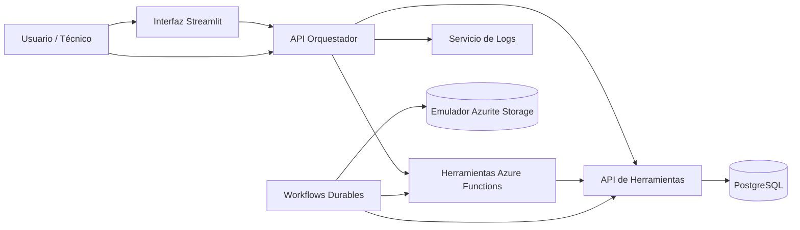

# Plataforma de Agente IA para Mantenimiento Industrial

Plataforma de mantenimiento industrial con agente de IA construida con FastAPI, PostgreSQL, Docker, herramientas serverless, workflows durables y una interfaz de chat en Streamlit.

El sistema simula un entorno de mantenimiento de fábrica donde los usuarios pueden consultar información de equipos, órdenes de trabajo, refacciones, OEE, tiempo muerto, riesgo, historial de mantenimiento y patrones recurrentes de falla usando lenguaje natural.

## Descripción Del Proyecto

Este proyecto demuestra una arquitectura de mantenimiento basada en agentes. El usuario envía una pregunta a la interfaz de chat o al API, el orquestador detecta la intención, llama la herramienta o workflow correcto y devuelve una respuesta estructurada junto con una respuesta legible para la interfaz.

Capacidades principales:

- Consulta de estado e información de equipos.
- Consulta de órdenes de trabajo abiertas, críticas e históricas.
- Creación de órdenes de trabajo mediante herramientas serverless.
- Consulta de inventario de refacciones.
- Cálculo de riesgo de falla.
- Ranking de OEE y tiempo muerto.
- Resumen semanal de mantenimiento.
- Recomendaciones de mantenimiento.
- Análisis de patrones recurrentes de falla.
- Ejecución de workflow durable de mantenimiento.

## Arquitectura



## Servicios

| Servicio | Puerto | Propósito |
|---|---:|---|
| Interfaz Streamlit | 8501 | Interfaz de chat para demo |
| API Orquestador | 8000 | API principal del agente y endpoint `/chat` |
| API de Herramientas | 8001 | Herramientas de mantenimiento y acceso a PostgreSQL |
| Servicio de Logs | 8002 | Registro de solicitudes y eventos |
| Azure Functions Tools | 7071 | Wrappers serverless de herramientas |
| Durable Workflows | 7072 | Orquestación del workflow de mantenimiento |
| PostgreSQL | 5432 | Base de datos de mantenimiento |
| Azurite | 10000-10002 | Emulador local de Azure Storage para Durable Functions |

## Ejecutar El Proyecto

Requisitos:

- Docker Desktop
- Git
- PowerShell o terminal compatible

Iniciar todos los servicios:

```powershell
docker compose up -d --build
```

Verificar estado de servicios:

```powershell
docker compose ps
```

Abrir la interfaz:

```text
http://localhost:8501
```

Probar el API de chat:

```powershell
Invoke-RestMethod `
  -Uri "http://localhost:8000/chat" `
  -Method POST `
  -ContentType "application/json" `
  -Body '{"user_id":"demo-user","message":"¿Cuál es el estado de PRESS-01?"}'
```

## Base De Datos

Configuración por defecto de PostgreSQL:

```text
Database: maintenance_db
User: maintenance_user
Password: maintenance_pass
```

Dataset actual de demo:

| Tabla | Registros |
|---|---:|
| equipment | 20 |
| work_orders | 693 |
| maintenance_history | 101 |
| spare_parts | 80 |

## Preguntas Para Demo

Información de equipos:

```text
¿Cuál es el estado de PRESS-01?
Muestra información de ROBOT-01
```

Órdenes de trabajo:

```text
¿Hay órdenes abiertas para ROBOT-01?
Muestra todas las órdenes de PRESS-01
Muestra todas las órdenes críticas.
Crear orden de trabajo para PRESS-01 porque se está sobrecalentando
```

Riesgo y priorización:

```text
¿Cuál es el riesgo de PRESS-01?
¿Qué máquina tiene el mayor riesgo?
¿Qué equipo debo priorizar hoy?
```

Refacciones:

```text
¿Hay refacciones disponibles para CNC-01?
```

OEE y tiempo muerto:

```text
¿Qué equipo genera más tiempo muerto?
¿Qué máquina tiene el menor OEE?
¿Cuál es el OEE de PRESS-01?
```

Recomendaciones de mantenimiento:

```text
Mantenimiento recomendado para PRESS-01
¿Qué mantenimiento se debe hacer hoy?
¿Qué mantenimiento recomiendas para hoy?
```

Análisis de patrones de falla:

```text
¿Cuál es la falla más común?
¿La fuga de aceite ha ocurrido antes en PRESS-01?
¿La vibración alta ha ocurrido antes en ROBOT-01?
¿La desviación de temperatura ha ocurrido antes en OVEN-01?
```

## Endpoints Principales

Orquestador:

| Método | Endpoint | Propósito |
|---|---|---|
| GET | `/` | Verificación de salud |
| POST | `/chat` | Chat principal de mantenimiento en lenguaje natural |
| POST | `/maintenance-case` | Caso de mantenimiento basado en herramientas |
| POST | `/critical-maintenance-workflow` | Flujo crítico de mantenimiento usando herramientas |
| POST | `/ai-maintenance-advisor` | Asesor de mantenimiento con múltiples fuentes |

API de Herramientas:

| Método | Endpoint | Propósito |
|---|---|---|
| GET | `/` | Verificación de salud |
| POST | `/get_equipment_info` | Información de equipo |
| POST | `/get_maintenance_history` | Historial de mantenimiento |
| POST | `/check_spare_parts` | Inventario de refacciones |
| POST | `/create_work_order` | Creación de orden de trabajo |
| POST | `/predict_failure_risk` | Cálculo de riesgo de falla |
| GET | `/get_highest_risk_equipment` | Equipos con mayor riesgo |
| GET | `/get_critical_work_orders` | Órdenes de trabajo críticas |
| GET | `/get_downtime_ranking` | Ranking de tiempo muerto |
| POST | `/calculate_oee` | Cálculo de OEE por equipo |
| GET | `/get_oee_ranking` | Ranking de OEE |
| GET | `/weekly_maintenance_summary` | Resumen semanal de mantenimiento |
| POST | `/analyze_failure_pattern` | Análisis de patrones recurrentes de falla |
| POST | `/upsert_equipment` | Crear o actualizar datos maestros de equipo |
| POST | `/update_equipment_status` | Actualizar estado operativo de equipo |
| POST | `/upsert_spare_part` | Crear o actualizar inventario de refacciones |
| POST | `/adjust_spare_part_inventory` | Ajustar cantidad de refacciones |
| POST | `/update_work_order` | Actualizar campos o estado de una orden |
| POST | `/record_maintenance_history` | Agregar registro de historial de mantenimiento |
| POST | `/submit_technician_report` | Enviar reporte de técnico y guardar actualizaciones relacionadas |

Herramientas serverless:

| Método | Endpoint | Propósito |
|---|---|---|
| POST | `/api/get_equipment_info` | Consulta serverless de equipo |
| POST | `/api/create_work_order` | Creación serverless de orden de trabajo |
| POST | `/api/send_notification` | Simulación serverless de notificación |
| POST | `/api/maintenance_workflow/start` | Inicio del workflow durable de mantenimiento |

## API Para Actualizar La Base De Datos

El proyecto incluye endpoints de escritura controlada para que usuarios y aplicaciones puedan alimentar nueva información en PostgreSQL a través de la capa de API, sin editar la base de datos directamente.

Flujo recomendado de entrada de datos:

```text
Usuario / UI / App -> Validación en Tools API -> PostgreSQL
```

Endpoint principal para técnicos:

```text
POST /submit_technician_report
```

Este endpoint puede:

- Crear o actualizar una orden de trabajo.
- Agregar un registro al historial de mantenimiento.
- Actualizar el estado del equipo.
- Descontar inventario de refacciones cuando se usa una pieza.
- Escribir un evento de auditoría.

La interfaz Streamlit incluye un formulario de reporte de técnico que llama este endpoint.

## Validación

Validado el 4 de junio de 2026:

- Docker Compose inicia todos los servicios.
- PostgreSQL inicia con healthcheck.
- Tools API responde correctamente.
- El orquestador `/chat` responde preguntas de mantenimiento.
- La interfaz Streamlit carga correctamente.
- Las herramientas Azure Functions responden correctamente.
- Durable Workflow completa correctamente.
- El análisis de patrones recurrentes de falla funciona desde el chat.

## Documentación

Documentos adicionales de entrega:

- [`docs/technical-report.md`](docs/technical-report.md)
- [`docs/demo-script.md`](docs/demo-script.md)

## Repositorio

```text
https://github.com/jczavala2099/maintenance-ai-agent-platform
```
