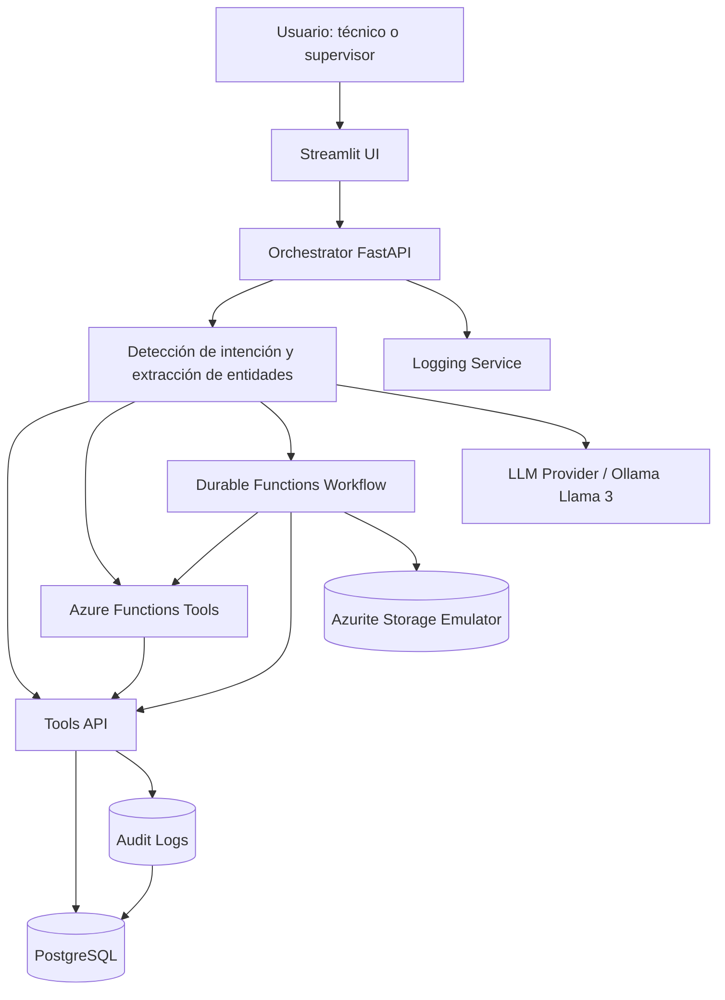
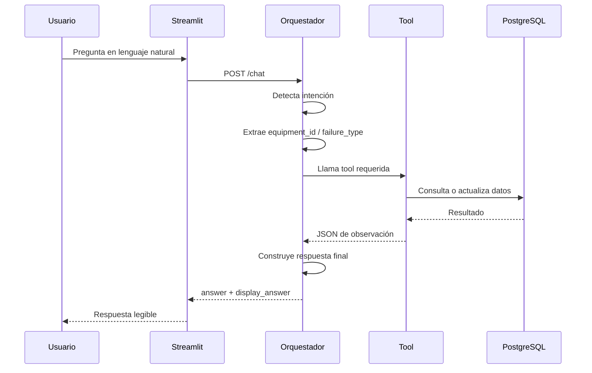
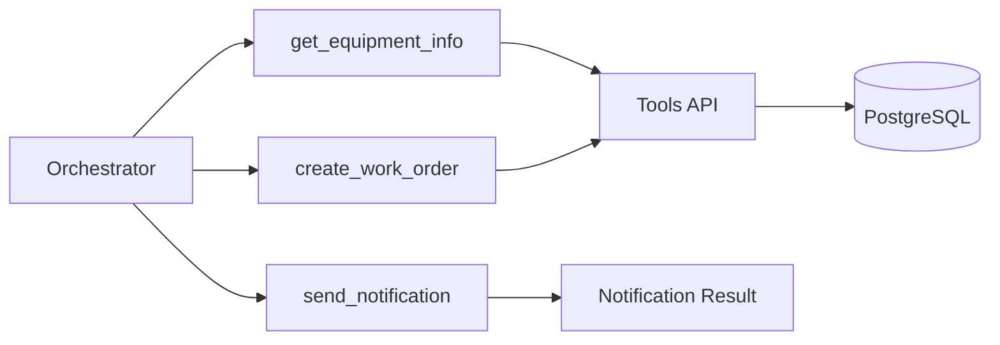
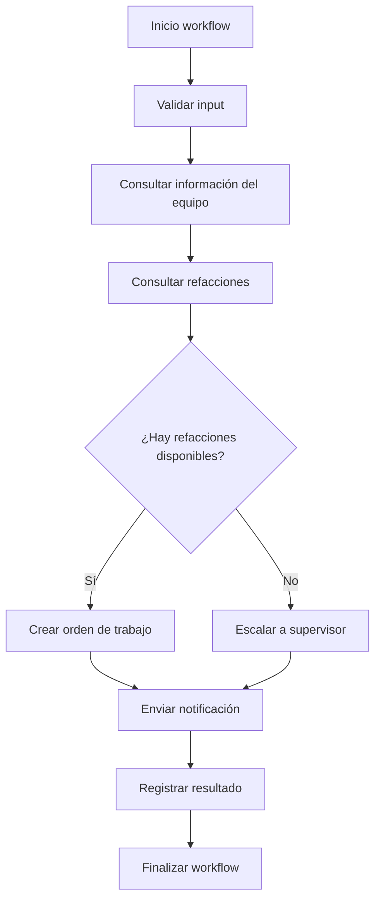
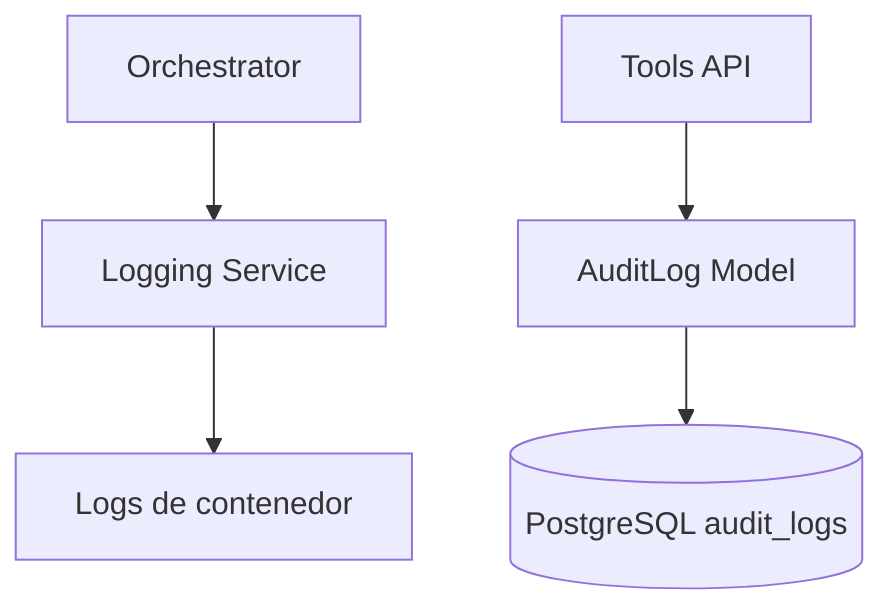

# Arquitectura - Proyecto 3

## 1. Visión General

La solución implementa una arquitectura de agente IA para mantenimiento industrial usando patrón agentic, tool-calling, funciones serverless, workflows durables, servicios contenerizados y base de datos estructurada.

## 2. Diagrama Lógico Principal

## 3. Flujo ReAct + Tool-Calling

El patrón principal es ReAct: el agente interpreta la intención, decide qué acción ejecutar, llama una tool, observa el resultado y genera una respuesta.

## 4. Mecanismo De Decisión Del Agente

El orquestador evalúa la pregunta contra intenciones soportadas:

| Intención | Tool |
|---|---|
| Estado de equipo | `get_equipment_info` |
| Órdenes abiertas | `get_open_work_orders` |
| Todas las órdenes | `get_all_work_orders` |
| Crear orden | `create_work_order` vía Azure Function |
| Riesgo | `predict_failure_risk` |
| Refacciones | `check_spare_parts` |
| OEE | `calculate_oee` |
| Tiempo muerto | `get_downtime_ranking` |
| Falla común | `dashboard/top-failure-types` |
| Patrón de falla | `analyze_failure_pattern` |
| Mantenimiento diario | combinación de riesgo, órdenes críticas y tiempo muerto |

## 5. Arquitectura Serverless

Las Azure Functions implementan tools independientes:

## 6. Workflow Durable

El workflow multi-paso modela un proceso crítico de mantenimiento:

## 7. Contenerización

Servicios contenerizados:

| Servicio | Imagen | Seguridad |
|---|---|---|
| Orchestrator | Python FastAPI | Multi-stage, non-root |
| Tools API | Python FastAPI | Multi-stage, non-root |
| Logging Service | Python FastAPI | Multi-stage, non-root |
| Streamlit UI | Python Streamlit | Imagen liviana |
| Azure Functions Tools | Azure Functions Python | Runtime oficial |
| Durable Workflows | Azure Functions Python | Runtime oficial |
| PostgreSQL | Postgres 16 | Imagen oficial |
| Azurite | Microsoft Azurite | Imagen oficial |

## 8. Observabilidad

Se observan:

- Requests al agente.
- Tool-calls.
- Eventos de workflow.
- Escrituras operativas.
- Auditoría de reportes técnicos.

## 9. Infraestructura Y Puertos

| Componente | Puerto |
|---|---:|
| Streamlit UI | 8501 |
| Orchestrator | 8000 |
| Tools API | 8001 |
| Logging Service | 8002 |
| Azure Functions Tools | 7071 |
| Durable Workflows | 7072 |
| PostgreSQL | 5432 |
| Azurite Blob | 10000 |
| Azurite Queue | 10001 |
| Azurite Table | 10002 |

## 10. Trade-Offs De Arquitectura

| Decisión | Ventaja | Trade-off |
|---|---|---|
| Orquestador central | Control claro de intenciones | Menos flexible que tool-calling nativo completo |
| Tools API separada | Reutilizable por chat, functions y UI | Requiere mantener contratos JSON |
| Serverless wrappers | Demuestra cloud-native tools | En local depende de runtime Azure Functions |
| Durable workflow | Modela proceso empresarial multi-paso | Más componentes que una API simple |
| PostgreSQL | Datos estructurados y consultables | Requiere administración de credenciales |
| Streamlit | Demo rápida y funcional | No reemplaza una app empresarial completa |

