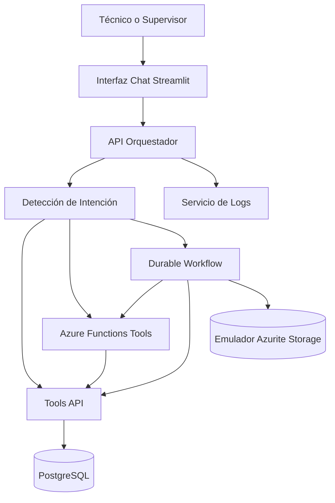

# Reporte Técnico - Plataforma de Agente IA para Mantenimiento Industrial

## 1. Contexto Del Proyecto

Este proyecto implementa una plataforma de mantenimiento industrial asistida por IA para un entorno simulado de fábrica. El sistema está diseñado para ayudar a técnicos y supervisores de mantenimiento a consultar estado de equipos, identificar prioridades, revisar órdenes de trabajo, validar refacciones, analizar riesgo operativo y detectar patrones recurrentes de falla.

La solución sigue una arquitectura basada en agentes: el usuario hace una pregunta en lenguaje natural, el orquestador interpreta la solicitud y el sistema llama la herramienta, API, consulta de base de datos o workflow serverless correspondiente.

## 2. Objetivo Del Proyecto

El objetivo es demostrar una arquitectura práctica para operaciones de mantenimiento usando:

- Orquestación de agente IA.
- Servicios backend basados en herramientas.
- Wrappers serverless con Azure Functions.
- Orquestación con Durable Functions.
- Datos operativos estructurados.
- Interfaz de chat para técnicos.

El proyecto no es solamente un dashboard. Es un asistente interactivo de mantenimiento capaz de combinar múltiples fuentes de datos y herramientas operativas.

## 3. Arquitectura General

La plataforma está compuesta por las siguientes capas:

1. Capa de interfaz de usuario: chat en Streamlit.
2. Capa de orquestación: orquestador FastAPI.
3. Capa de ejecución de herramientas: Tools API y Azure Functions Tools.
4. Capa de workflow: Azure Durable Functions.
5. Capa de datos: PostgreSQL.
6. Capa de emulación de storage: Azurite para Durable Functions local.
7. Capa de logging: servicio separado de registros.



## 4. Responsabilidades De Componentes

### API Orquestador

El orquestador es el API principal del agente. Recibe preguntas en lenguaje natural mediante `/chat`, detecta intención, extrae IDs de equipo o tipos de falla cuando están disponibles, llama la herramienta correcta y devuelve JSON estructurado junto con una respuesta formateada para la interfaz.

Responsabilidades:

- Detección de intención.
- Extracción de ID de equipo.
- Extracción de tipo de falla.
- Enrutamiento hacia herramientas.
- Formato de respuesta.
- Agregación de datos desde múltiples fuentes.

### Tools API

Tools API contiene la lógica principal de negocio para operaciones de mantenimiento. Se conecta a PostgreSQL y expone endpoints para equipos, órdenes de trabajo, OEE, riesgo, tiempo muerto, refacciones y análisis de patrones de falla.

Responsabilidades:

- Acceso a base de datos.
- Métricas de mantenimiento.
- Cálculo de riesgo.
- Cálculo de OEE.
- Consulta de refacciones.
- Creación y actualización de órdenes de trabajo.
- Análisis de patrones de falla.

### Azure Functions Tools

Estas funciones envuelven operaciones seleccionadas en estilo serverless. Simulan cómo una arquitectura cloud-native puede exponer acciones de mantenimiento independientemente del API principal.

Funciones:

- `get_equipment_info`
- `create_work_order`
- `send_notification`

### Durable Workflows

El Durable Workflow modela un proceso de mantenimiento de múltiples pasos:

1. Validar entrada del workflow.
2. Obtener información del equipo.
3. Verificar disponibilidad de refacciones.
4. Decidir si se requiere una orden de trabajo.
5. Crear una orden de trabajo cuando corresponde.
6. Enviar una notificación.
7. Devolver el resultado final del workflow.

Esto demuestra orquestación más allá de una llamada simple de API.

### PostgreSQL

PostgreSQL almacena los datos operativos de mantenimiento:

- Equipos.
- Órdenes de trabajo.
- Historial de mantenimiento.
- Inventario de refacciones.

El dataset fue expandido para simular cinco años de actividad de mantenimiento y suficientes registros para análisis significativos.

## 5. Resumen Del Modelo De Datos

### Equipo

Almacena identificadores de equipo, nombre, área, criticidad y estado operativo.

Ejemplos:

- `PRESS-01`
- `ROBOT-01`
- `CNC-01`
- `OVEN-01`

### Órdenes De Trabajo

Almacena registros de mantenimiento correctivo y preventivo, incluyendo prioridad, descripción, acción recomendada, estado, tiempo muerto estimado y timestamps.

Las órdenes de trabajo se usan para:

- Consultas de órdenes abiertas.
- Consultas de órdenes críticas.
- Ranking de tiempo muerto.
- Impacto en OEE.
- Análisis de recurrencia de fallas.

### Historial De Mantenimiento

Almacena eventos de mantenimiento completados en un periodo de cinco años. Esto permite consultas históricas y contexto de largo plazo.

### Refacciones

Almacena inventario por equipo y tipo de parte, incluyendo disponibilidad, cantidad, almacén y estado de stock.

## 6. Acceso A Base De Datos Y Entrada De Datos

PostgreSQL es el sistema de registro para los datos de mantenimiento. En esta arquitectura, los usuarios de aplicación no deben conectarse directamente a la base de datos. El acceso directo debe limitarse a administración, desarrollo, respaldos, exportaciones de reporte o tareas controladas de mantenimiento de datos.

Patrón recomendado de acceso:

```text
Interfaz / Cliente Externo -> API Orquestador -> Tools API -> PostgreSQL
```

Patrón recomendado de escritura:

```text
Acción de usuario -> Validación API -> Reglas de negocio -> Escritura en base de datos -> Respuesta estructurada
```

Esto mantiene validación, permisos, logging y reglas de negocio en la capa de aplicación.

### Cómo Entra Nueva Información Al Sistema

En la versión actual, la información entra por estas rutas:

1. Carga inicial mediante el seed script.
2. Creación de órdenes de trabajo mediante Tools API o Azure Functions.
3. Ejecución de Durable Workflow, que puede crear una orden dentro de un proceso controlado.
4. Envío de reporte técnico desde la UI o Tools API.
5. Endpoints controlados para actualizar equipos, órdenes, refacciones e historial.

| Tipo De Dato | Entrada Recomendada | Razón |
|---|---|---|
| Datos maestros de equipo | Formulario/API admin o import controlado | Evita IDs duplicados o inválidos |
| Órdenes de trabajo | Chat, formulario UI, Tools API o serverless tool | Mantiene validación y lógica de workflow |
| Historial de mantenimiento | Flujo de cierre o import controlado | Asegura que el historial represente trabajo completado |
| Inventario de refacciones | API de inventario, formulario admin o import ERP/CMMS | Mantiene cantidades correctas |
| Notas de falla | Formulario de reporte de orden | Captura texto útil para análisis de recurrencia |

Los técnicos deben alimentar información mediante la interfaz de aplicación, no por SQL directo. Por ejemplo, un técnico crea un ticket o reporte en la UI; el API valida el equipo y campos requeridos; después Tools API almacena el registro en PostgreSQL.

### Endpoints Implementados Para Actualizar Datos

| Método | Endpoint | Propósito |
|---|---|---|
| POST | `/upsert_equipment` | Crear o actualizar datos maestros de equipo |
| POST | `/update_equipment_status` | Actualizar estado de equipo |
| POST | `/upsert_spare_part` | Crear o actualizar inventario de refacciones |
| POST | `/adjust_spare_part_inventory` | Aumentar o disminuir cantidad de refacción |
| POST | `/update_work_order` | Actualizar campos o estado de una orden |
| POST | `/record_maintenance_history` | Agregar registro de historial de mantenimiento |
| POST | `/submit_technician_report` | Enviar reporte técnico y persistir actualizaciones relacionadas |

El endpoint `submit_technician_report` es el punto principal de entrada operativa. Puede crear o actualizar una orden, registrar historial, actualizar estado de equipo, descontar inventario y escribir auditoría en una sola transacción controlada.

### Credenciales De Base De Datos

La base local está configurada con:

```text
Database: maintenance_db
User: maintenance_user
Password: maintenance_pass
```

Estas credenciales son para el entorno local Docker. En un ambiente controlado, las credenciales deben almacenarse como secretos y los usuarios deben autenticarse mediante la aplicación, no con credenciales compartidas de base de datos.

## 7. Capacidades Del Chat Del Agente

El endpoint de chat soporta múltiples intenciones:

- Información de equipo.
- Órdenes abiertas.
- Todas las órdenes por equipo.
- Órdenes críticas.
- Creación de orden de trabajo.
- Riesgo.
- Equipos con mayor riesgo.
- Priorización diaria de mantenimiento.
- Disponibilidad de refacciones.
- Ranking de tiempo muerto.
- OEE por equipo.
- Equipos con menor OEE.
- Resumen semanal de mantenimiento.
- Historial de mantenimiento.
- Mantenimiento recomendado.
- Falla más común.
- Análisis de recurrencia de fallas.

La respuesta del chat incluye JSON estructurado y, para respuestas más ricas, un campo `display_answer` formateado para la UI.

## 8. Análisis De Patrones De Falla

La función de patrón de falla analiza órdenes históricas para responder preguntas como:

```text
¿La fuga de aceite ha ocurrido antes en PRESS-01?
```

El sistema identifica:

- ID de equipo.
- Tipo de falla.
- Órdenes coincidentes dentro de la ventana de análisis.
- Número de ocurrencias.
- Ocurrencias críticas.
- Órdenes abiertas.
- Días promedio entre fallas.
- Nivel de recurrencia.
- Acción correctiva más común.
- Recomendación.
- Score de confianza.

Este análisis se basa en reglas y estadísticas. No es un modelo ML entrenado. La implementación actual usa registros históricos, conteos de recurrencia, tiempo entre fallas y acciones correctivas comunes para generar recomendaciones de mantenimiento.

## 9. Cálculo De Riesgo

La herramienta de riesgo estima el riesgo de equipo usando indicadores operativos como:

- Criticidad del equipo.
- Número de órdenes de trabajo.
- Órdenes abiertas.
- Órdenes críticas.
- Impacto por tiempo muerto.

El resultado incluye score de riesgo, nivel de riesgo e indicadores de soporte.

## 10. OEE Y Tiempo Muerto

La plataforma incluye herramientas para:

- Calcular OEE para un equipo específico.
- Rankear equipos con menor OEE.
- Rankear equipos por tiempo muerto estimado.

Estas métricas ayudan a decidir qué equipo debe priorizar mantenimiento.

## 11. Workflow Serverless

El Durable Workflow demuestra un escenario realista de automatización de mantenimiento:

```text
Input: equipment_id, priority, description, recommended_action, requested_by
```

Resultado del workflow:

- Información de equipo obtenida.
- Refacciones verificadas.
- Decisión tomada.
- Orden de trabajo creada si corresponde.
- Notificación enviada.
- Estado final del workflow devuelto.

El workflow valida que una orquestación serverless puede coordinar múltiples herramientas independientes.

## 12. Resultados De Validación

Validaciones completadas el 4 de junio de 2026:

| Validación | Resultado |
|---|---|
| Arranque Docker Compose | Aprobado |
| Healthcheck PostgreSQL | Aprobado |
| Health check Tools API | Aprobado |
| Solicitud al chat del orquestador | Aprobado |
| Carga de interfaz Streamlit | Aprobado |
| Llamada a Azure Function | Aprobado |
| Ejecución Durable Workflow | Aprobado |
| Pregunta de patrón de falla desde chat | Aprobado |

Dataset validado:

| Tabla | Registros |
|---|---:|
| equipment | 20 |
| work_orders | 693 |
| maintenance_history | 101 |
| spare_parts | 80 |

## 13. Limitaciones Actuales

Limitaciones actuales:

- La detección de intención se basa en reglas.
- El análisis de patrones de falla es estadístico, no un modelo ML entrenado.
- No se implementó autenticación ni control de acceso por roles.
- La interfaz actual es una interfaz demo con Streamlit.
- Power BI es opcional y no es requerido para que el sistema funcione.
- El despliegue externo en Azure no forma parte del entregable actual.

## 14. Consideraciones Operativas

Para un entorno operativo controlado, el sistema debe administrarse con:

- Autenticación segura.
- Acceso por roles para acciones de mantenimiento.
- Auditoría de acciones.
- Procedimientos de respaldo y recuperación.
- Control de migraciones de base de datos.
- Gestión de secretos.
- Monitoreo de APIs, workflows y salud de base de datos.
- Validación de IDs de equipo, estado de órdenes, cantidad de refacciones y fechas de mantenimiento.

## 15. Alineación Formal Con Los 12 Puntos Requeridos

Esta sección mapea la implementación contra los 12 componentes requeridos para una arquitectura de agentes con serverless y tools.

| # | Componente | Evidencia En El Proyecto |
|---:|---|---|
| 1 | Definición avanzada del caso de uso | Agente de mantenimiento industrial para técnicos, supervisores y planeadores; incluye flujos de consulta, creación de órdenes, reportes, riesgo, refacciones, OEE y recurrencia de fallas |
| 2 | Selección del modelo + infraestructura | Arquitectura compatible con Llama 3 vía Ollama en local; el diseño también permite sustituir por Azure OpenAI, Bedrock o Vertex AI mediante variable de proveedor |
| 3 | Patrón LLM agentic | Patrón ReAct + Tool-Calling: el orquestador detecta intención, decide tool, ejecuta acción, observa resultado y responde |
| 4 | Contenerización con Docker | Servicios separados en Docker Compose; FastAPI con Dockerfiles multi-stage y usuario non-root; imágenes separadas por responsabilidad |
| 5 | Tooling serverless | Azure Functions Tools implementa `get_equipment_info`, `create_work_order` y `send_notification` como tools invocables |
| 6 | Arquitectura lógica | Documentada en `docs/architecture.md` con Streamlit, Orchestrator, LLM provider, Tools API, Azure Functions, Durable Workflows, PostgreSQL y Logging |
| 7 | Diseño del conjunto de tools | Documentado en `docs/tool-schemas.md` con input, output, errores y contratos JSON |
| 8 | Workflows serverless | Durable Functions ejecuta un flujo multi-paso para mantenimiento crítico con consulta, decisión, creación de orden y notificación |
| 9 | CI/CD | `.github/workflows/cicd.yml` instala dependencias, valida sintaxis y construye imágenes Docker principales |
| 10 | Costos y performance | Se documentan estrategias de optimización: small-first, cache, reducción de pasos, control de llamadas a tools y comparación conceptual de modelos |
| 11 | Observabilidad, logs y auditoría | Logging Service, logs de contenedores, trazabilidad de tool-calls y tabla `audit_logs` para escrituras operativas |
| 12 | Documentación final profesional | Documentos separados: reporte técnico, guía de usuario, guía de administrador, arquitectura, tool schemas, resultados de pruebas y guion de demo |

## 16. KPIs Del Agente

Los KPIs solicitados por la guía se definen así:

| KPI | Definición | Cómo Se Mide En El Proyecto |
|---|---|---|
| Task Success Rate | Porcentaje de preguntas o tareas completadas correctamente | Preguntas aprobadas / preguntas ejecutadas en `docs/test-results.md` |
| Tool-Call Success Rate | Porcentaje de tools que responden `status=success` | Tool-calls exitosas / tool-calls totales |
| Latencia de resolución | Tiempo entre pregunta del usuario y respuesta final | Tiempo de respuesta del endpoint `/chat` |
| Pasos promedio por tarea | Número promedio de llamadas internas por intención | Conteo de tools ejecutadas por pregunta |
| Errores manejados correctamente | Porcentaje de errores con respuesta controlada | Errores con `status=error` y mensaje claro / errores totales |

## 17. Selección Del Modelo E Infraestructura

El proyecto se diseñó para trabajar con un LLM local mediante Ollama y Llama 3. Esta elección es adecuada para un entorno académico y de demo porque reduce costo operativo, evita dependencias externas durante la presentación y permite ejecutar pruebas localmente.

Justificación:

| Criterio | Decisión |
|---|---|
| Capacidad de razonamiento | Suficiente para recomendaciones y explicación de mantenimiento |
| Velocidad | Adecuada para demo local y respuestas cortas |
| Costo | Sin costo por token en ejecución local |
| Tool-calling | Implementado mediante orquestador y contratos JSON |
| Latencia esperada | Depende del equipo local y complejidad de la pregunta |
| Riesgos | Menor precisión que modelos gestionados grandes; mitigado con tools determinísticas |

La arquitectura permite reemplazar el proveedor LLM por Azure OpenAI, AWS Bedrock o Vertex AI sin cambiar la lógica central de tools.

## 18. Patrón ReAct Y Trade-Offs

El patrón ReAct se implementa de forma práctica:

```text
Reason: detectar intención y entidades
Act: llamar tool
Observe: recibir JSON de la tool
Respond: construir respuesta final
```

Trade-offs:

| Ventaja | Costo |
|---|---|
| Control explícito de herramientas | Requiere mantener reglas de intención |
| Respuestas más confiables por datos reales | Menos flexible que un agente completamente autónomo |
| Menor riesgo de alucinación | Requiere diseñar contratos JSON |
| Fácil de auditar | Más código en el orquestador |

## 19. Optimización De Costos Y Performance

Estrategias aplicadas o documentadas:

| Estrategia | Impacto |
|---|---|
| Modelo local small-first | Reduce costo por token en demo |
| Tools determinísticas | Evita llamadas innecesarias al LLM |
| Respuestas estructuradas | Reduce tokens de salida |
| Intenciones directas | Reduce profundidad de reasoning |
| Docker Compose local | Reduce costo de infraestructura para entrega académica |
| Cache potencial para rankings | Reduce consultas repetidas a base de datos |

Comparación conceptual:

| Modelo | Ventaja | Uso Recomendado |
|---|---|---|
| Llama 3 local | Bajo costo, control local | Demo, desarrollo, pruebas |
| GPT-4o mini | Baja latencia y buen costo | Producción con tool-calling gestionado |
| GPT-4o / Claude Sonnet | Mayor razonamiento | Casos críticos o análisis más complejo |

## 20. Riesgos Y Mitigaciones

| Riesgo | Mitigación |
|---|---|
| Docker Desktop cerrado | Validar `docker compose ps` antes de demo |
| Preguntas ambiguas | Respuestas de error con ejemplos válidos |
| Datos incompletos | Seed expandido y endpoints para alimentar datos |
| Inventario incorrecto | Ajustes controlados por API y validación de cantidades negativas |
| Fallos de tool | Manejo de errores con `status=error` |
| Falta de autenticación | Documentado como restricción del alcance académico |
| Alucinación del LLM | Uso de datos estructurados y tools determinísticas |

## 21. Documentos Complementarios

| Documento | Propósito |
|---|---|
| `docs/user-guide.md` | Guía de uso para técnicos y supervisores |
| `docs/admin-guide.md` | Operación, Docker, base de datos, logs y troubleshooting |
| `docs/tool-schemas.md` | Contratos JSON de tools |
| `docs/architecture.md` | Diagramas de arquitectura, ReAct y workflows |
| `docs/test-results.md` | Evidencia de pruebas y resultados |
| `docs/demo-script.md` | Guion de presentación |

## 22. Conclusión

El proyecto demuestra una arquitectura funcional de agente IA para mantenimiento con uso de herramientas, funciones serverless, orquestación durable, datos estructurados y experiencia de usuario basada en chat.

El sistema implementado soporta consultas de mantenimiento, workflows de órdenes de trabajo, priorización operativa, validación de inventario, análisis OEE, ranking de tiempo muerto y análisis recurrente de fallas usando el dataset actual de fábrica simulada.

