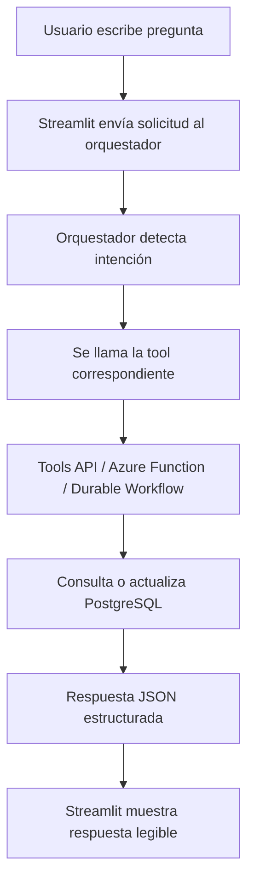

# Guía De Usuario - Plataforma De Agente IA Para Mantenimiento Industrial

## 1. Objetivo De La Guía

Esta guía explica cómo un técnico, supervisor o usuario operativo utiliza la plataforma para consultar información de mantenimiento, crear reportes, revisar órdenes de trabajo, validar refacciones y obtener recomendaciones del agente IA.

## 2. Usuarios Objetivo

| Usuario | Uso Principal |
|---|---|
| Técnico de mantenimiento | Consultar tickets asignados, reportar fallas, registrar acciones realizadas y validar refacciones |
| Supervisor de mantenimiento | Priorizar equipos críticos, revisar órdenes abiertas, consultar riesgo y tiempo muerto |
| Planeador de mantenimiento | Revisar OEE, historial, recurrencia de fallas e inventario |
| Administrador técnico | Validar funcionamiento general del sistema y disponibilidad de servicios |

## 3. Acceso A La Aplicación

La interfaz principal se ejecuta en Streamlit:

```text
http://localhost:8501
```

El usuario interactúa con el agente mediante una caja de texto. La pregunta se envía al orquestador, el orquestador detecta la intención, llama las herramientas necesarias y devuelve una respuesta formateada.

## 4. Flujo Básico De Uso



## 5. Preguntas Soportadas

### Información De Equipo

```text
¿Cuál es el estado de PRESS-01?
Muestra información de ROBOT-01
```

Respuesta esperada:

- ID de equipo.
- Nombre.
- Área.
- Criticidad.
- Estado operativo.

### Órdenes De Trabajo

```text
¿Hay órdenes abiertas para ROBOT-01?
Muestra todas las órdenes de PRESS-01
Muestra todas las órdenes críticas.
```

Respuesta esperada:

- Conteo de órdenes.
- Prioridad.
- Estado.
- Descripción.
- Fecha de creación.

### Creación De Orden

```text
Crear orden de trabajo para PRESS-01 porque se está sobrecalentando
```

Respuesta esperada:

- Confirmación de creación.
- ID de orden.
- Tool serverless usada.
- Equipo asociado.

### Riesgo Y Priorización

```text
¿Cuál es el riesgo de PRESS-01?
¿Qué máquina tiene el mayor riesgo?
¿Qué equipo debo priorizar hoy?
¿Qué mantenimiento se debe hacer hoy?
```

Respuesta esperada:

- Score de riesgo.
- Nivel de riesgo.
- Equipos prioritarios.
- Acción recomendada.

### Refacciones

```text
¿Hay refacciones disponibles para CNC-01?
```

Respuesta esperada:

- Disponibilidad.
- Inventario por refacción.
- Cantidad.
- Almacén.
- Estado de stock.

### OEE Y Tiempo Muerto

```text
¿Cuál es el OEE de PRESS-01?
¿Qué máquina tiene el menor OEE?
¿Qué equipo genera más tiempo muerto?
```

Respuesta esperada:

- OEE.
- Disponibilidad.
- Performance.
- Calidad.
- Tiempo muerto estimado.
- Ranking de equipos.

### Historial Y Patrones De Falla

```text
¿Qué historial de mantenimiento tiene ROBOT-01?
¿Cuál es la falla más común?
¿La fuga de aceite ha ocurrido antes en PRESS-01?
Mantenimiento recomendado para PRESS-01
```

Respuesta esperada:

- Última falla.
- Acción correctiva.
- Ocurrencias históricas.
- Nivel de recurrencia.
- Acción más común.
- Recomendación.

## 6. Registro De Reporte Técnico

La interfaz incluye un formulario para registrar información nueva de mantenimiento.

Campos principales:

| Campo | Descripción |
|---|---|
| ID de Equipo | Equipo afectado, por ejemplo `PRESS-01` |
| Reportado Por | Usuario que registra el evento |
| Prioridad | Nivel operativo de la orden |
| Tipo de Falla | Falla observada |
| Acción Tomada | Acción correctiva o preventiva realizada |
| Estado del Equipo | Estado posterior al reporte |
| Estado de Orden | Estado de la orden asociada |
| Refacción Usada | Parte utilizada, si aplica |
| Cantidad | Cantidad descontada del inventario |

Cuando se envía el reporte, el sistema puede:

- Crear o actualizar una orden de trabajo.
- Registrar historial de mantenimiento.
- Actualizar estado del equipo.
- Descontar inventario.
- Registrar auditoría.

## 7. Interpretación De Respuestas

El sistema devuelve dos niveles de información:

| Campo | Uso |
|---|---|
| `display_answer` | Texto formateado para mostrar en la UI |
| `answer` | JSON estructurado con los datos completos |

La UI prioriza `display_answer` cuando existe. Si la respuesta contiene listas o diccionarios, Streamlit los muestra como tablas, métricas o JSON.

## 8. Errores Comunes

| Mensaje | Causa | Acción Recomendada |
|---|---|---|
| No se detectó ID de equipo | La pregunta no incluye un equipo válido | Agregar un ID como `PRESS-01`, `CNC-01` o `ROBOT-01` |
| Endpoint no soportado | La intención no está implementada | Usar una pregunta similar a los ejemplos |
| Error conectando con el orquestador | Servicio detenido o Docker apagado | Verificar que Docker y los contenedores estén activos |
| No se encontraron datos | No existe historial o inventario para el equipo | Validar el equipo o cargar datos |

## 9. Buenas Prácticas De Uso

- Usar IDs exactos de equipo.
- Escribir una pregunta concreta.
- Para reportes, capturar falla y acción tomada con texto claro.
- Validar refacciones antes de cerrar una intervención.
- Usar la recomendación diaria para priorizar trabajo operativo.

